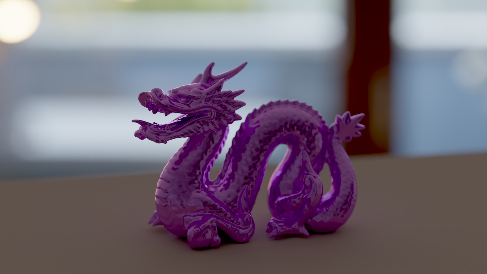
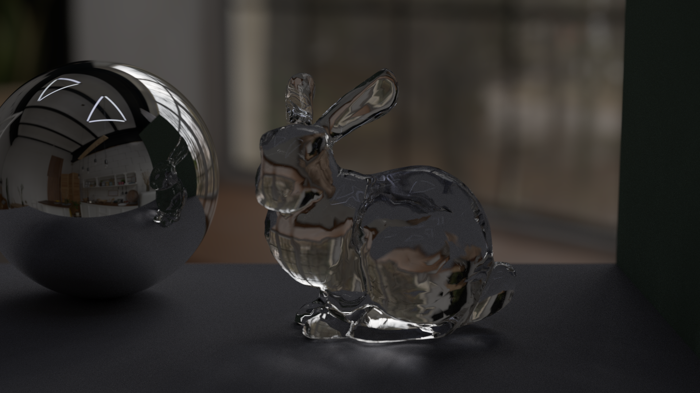
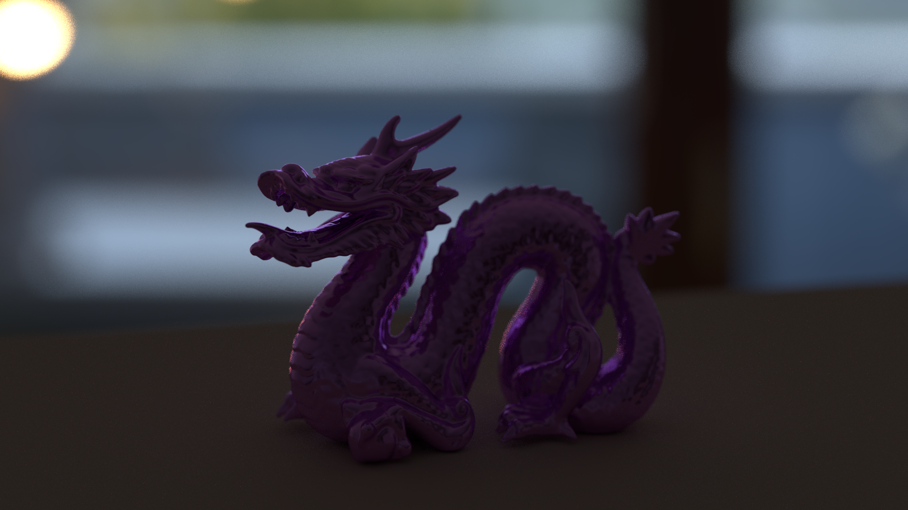
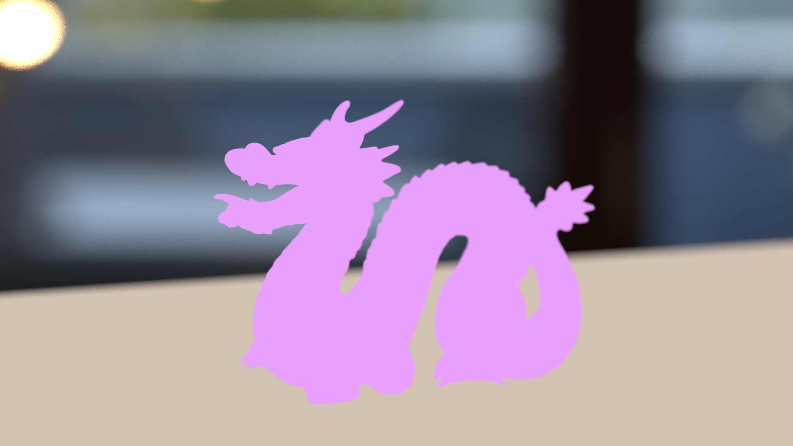
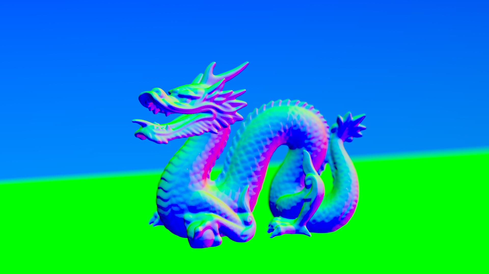
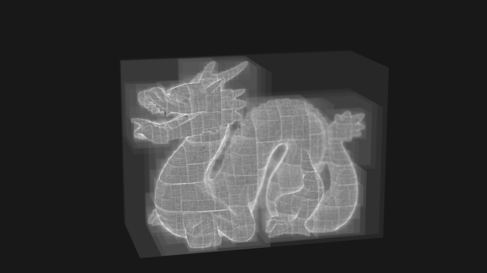
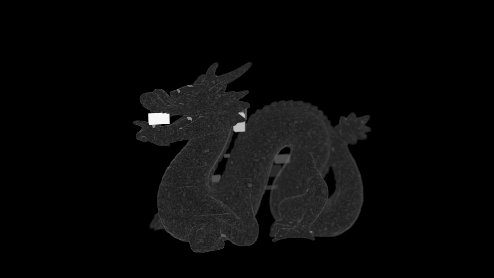

# Softpasses

Offline software pathtracer

## Current features

- Support for multiple types of primitives (Spheres, Triangles, Parallelograms, Parallelipeds)
- Handrolled BVH2 implementation (SAH construction, ordered traversal)
- Triangle mesh loading (.obj format)
- Mesh transformations: Scaling, Rotation, Translation
- Materials: Lambertian diffuse BRDF, basic glass BSDF and metallic BRDF
- Environment map defined lighting (.hdr, .exr)
- Generation of auxiliary passes (albedo, normal) for denoising
- Generation of BVH debug and visualization passes (node intersects, primitive checks)
- Multithreaded, tiled rendering
- Denoising through Intel OpenImageDenoise integration
- Basic filmic tonemapping

## Renders

All images were rendered and postprocessed exclusively within this software on an i7U quadcore @ 3.1 GHz processor.

1080p, 512 spp, ~870k triangles @ ~1 MRays/s in 17:45 minutes


1080p, 1024 spp, ~5k primitives @ ~0.7 MRays/s in 49:40 minutes (no denoising, tonemapping)


### Auxiliary and Intermediate passes
During each run, Softpasses also produces and outputs a collection of auxiliary/intermediate passes.

#### Color pass
The raw computed HDR luminance data before denoising, tonemapping and gamma correction.


#### Albedo and Normal passes
 Describing the diffuse reflection and surface normal properties of the scene, they serve as common auxiliary inputs for denoisers, and are fed to the Intel OIDN library during the postprocessing stage.



#### BVH visualization
BVH visualization passes such as **Average number of node checks per pixel** and **Average number of primitive checks per pixel** aid in profiling and debugging the acceleration structure. Both a heatmapped (ie normalized; as seen below) and raw HDR version are supplied.




## Planned features

- Environment map importance sampling
	(Contrast-rich environment maps lead to very noisy images currently. Ideally take advantage of MIS to importance sample both the environment map and materials.)
- Support for texture mapping on models (eg diffuse, roughness, metallic maps)
- Implementation of a physically based general-purpose BSDF, eg the Burley BSDF
- Support for a user friendly scene description format, like glTF or USD

## Building and Usage

Prerequisites: 
 - Have [Intel OpenImageDenoise](https://github.com/RenderKit/oidn) library installed
	(Packaged for Arch Linux: https://archlinux.org/packages/extra/x86_64/openimagedenoise/)

Then build in release mode (debug builds are *very* slow):
```cargo build --release```

Run the following to render the current scene:
```cargo run --release <output directory>```

There is no proper, userfriendly way to do so at the moment, but you can play around with the scene and render settings inside `main`. 

## References 

A brilliant practical introduction to the basics of raytracing, which this software was originally loosely based on:  
[Peter Shirley - Ray Tracing in One Weekend](https://raytracing.github.io/books/RayTracingInOneWeekend.html)

For all your physically accurate rendering needs:
[Pharr, Jakob, Humphreys - Physically Based Rendering: From Theory to Implementation](https://www.pbrt.org/)

A great tutorial on building BVHs:
[Bikker - How to Build a BVH (Article series)](https://jacco.ompf2.com/2022/04/13/how-to-build-a-bvh-part-1-basics/)

Arguably more of historical importance, these two papers were among the first to discuss the usage of BVHs in Raytracing. Regardless, they give a good overview of the fundamental problem at hand:
[Kay, Kajiya (1986) - Ray Tracing Complex Scenes](https://papers.cumincad.org/data/works/att/67d2.content.pdf?utm_source=chatgpt.com)
[Goldsmith, Salmon (1987) - Automatic Creation of Object Hierarchies for Ray Tracing](https://doi.org/10.1109/MCG.1987.276983)

